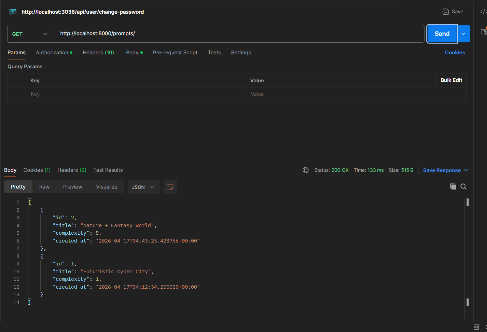
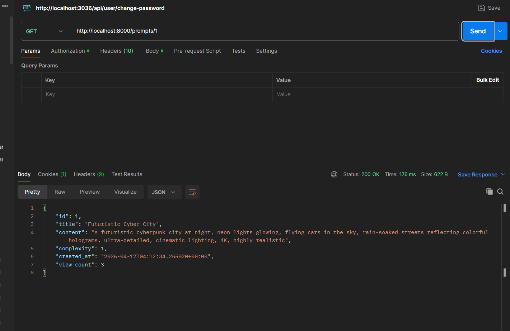

# AI Prompt Library

A full-stack web application for storing and managing AI image generation prompts.

## Tech Stack

| Layer       | Technology                    |
|-------------|-------------------------------|
| Frontend    | Angular 16 + Reactive Forms   |
| Backend     | Django 4.2 (plain views, no DRF) |
| Database    | PostgreSQL 14                 |
| Cache       | Redis 7 (view counters)       |
| Container   | Docker + Docker Compose        |

## Running the App

### Prerequisites
- Docker and Docker Compose installed

### Steps

1. Clone the repository:
   ```bash
   git clone <repo-url>
   cd ai-prompt-library
   ```

2. Start everything with one command:
   ```bash
   docker-compose up --build
   ```

3. Open your browser:
   - **Frontend:** http://localhost:4200
   - **Django Admin:** http://localhost:8000/admin
  <!-- to create admin login username and password using following command on cmd: -->
   docker exec -it prompt_backend python manage.py createsuperuser

> The backend entrypoint automatically waits for PostgreSQL and runs migrations before starting.

### Stopping the app
```bash
docker-compose down
```

To also remove the database volume:
```bash
docker-compose down -v
```

## API Endpoints

All endpoints return JSON. No authentication required.

### `GET /prompts/`
Returns a list of all prompts.

**Response:**



### `GET /prompts/:id/`
Returns a single prompt and **increments its view counter in Redis**.



